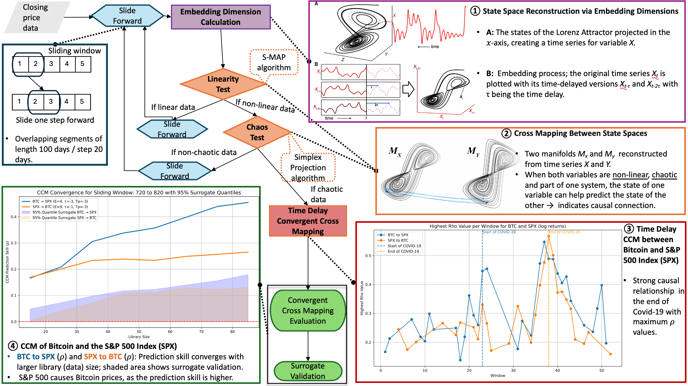

# Applying Time Delay Convergent Cross Mapping to Bitcoin Time Series



This repository contains the cleaned code and data for:

> Isufaj, A., De Castro Martins, C., Cavazza, M., & Prendinger, H. (2025). Applying time delay convergent cross mapping to Bitcoin time series. *Expert Systems with Applications*, 277, 127125. https://doi.org/10.1016/j.eswa.2025.127125

The goal is paper-parity reruns for the Bitcoin, S&P 500, and gold time-delay convergent cross mapping analysis. The repo intentionally depends on the upstream PyEDM v2.1.1 source commit instead of vendoring the original PyEDM source tree.

## Repository Layout

- `data/raw/bitcoin_sp500_gold_daily_prices_2017_2024.csv`: raw daily BTC, S&P 500, and gold prices.
- `data/processed/bitcoin_sp500_gold_normalized_log_returns_by_date.csv`: normalized log returns with calendar dates.
- `data/processed/bitcoin_sp500_gold_normalized_log_returns_pyedm.csv`: normalized log returns with integer time labels for PyEDM.
- `data/reference/`: directional TDCCM `rho` by window and `Tp` CSVs used to validate figure generation and slow parity reruns.
- `figures/overview_ccm.png`: README overview image.
- `figures/btc_spx_rho_per_window.pdf` and `figures/btc_gold_rho_per_window.pdf`: retained paper-parity final figures.
- `src/bitcoin_tdccm/`: preprocessing, TDCCM, surrogate, and plotting code.
- `scripts/`: thin command-line wrappers.
- `tests/`: unit tests plus an opt-in slow TDCCM parity test.

## Setup

Use the Conda environment named `tdccm`:

```bash
conda env create -f environment.yml
conda activate tdccm
python -m pip install -e .
```

If the environment already exists:

```bash
conda activate tdccm
python -m pip install -r requirements.txt
python -m pip install -e .
```

## Running The Analysis

Regenerate processed data from raw prices:

```bash
python scripts/preprocess.py
```

Regenerate the final paper-style figures from the checked reference TDCCM CSVs:

```bash
python scripts/make_figures.py --input-root data/reference --output-dir figures
```

Run the full TDCCM sweep. This is computationally expensive because each window searches embedding parameters and runs CCM over `Tp=-10..10`.

```bash
python scripts/run_tdccm.py --pair all --output-dir outputs/tdccm
```

Run tests:

```bash
pytest
```

The full parity rerun is opt-in:

```bash
RUN_SLOW_TDCCM=1 pytest -m slow
```

## Paper-Parity Defaults

- Assets: `BTC`, `SPX`, `GOLD`
- Pairs: `BTC-SPX`, `BTC-GOLD`
- Window size: `100`
- Step size: `30`
- Embedding search: `maxE=10`, `Tp=1`, PyEDM tau convention `tau=-3..-1`
- TDCCM lag search: `Tp=-10..10`
- CCM settings: `lib_sizes_min=15`, `lib_sizes_step=10`, `sample=100`, `seed=0`
- Surrogate setting: `num_surrogates=100`

## Known Parity Notes

The paper text describes a 20-point step, but the existing result artifacts contain 53 windows over 1,678 processed observations. That matches a 100-point window with a 30-point step, so `30` is the paper-parity default in this repository.

The final rho-per-window figures use manual window-removal lists from the original figure notebook. Those lists are centralized in `bitcoin_tdccm.config.PAPER_FIGURE_FILTERS` so they are explicit and auditable.

PyPI does not currently publish PyEDM v2.1.1; the available releases jump from v2.1.0 to v2.2.0. For paper parity, `pyproject.toml`, `requirements.txt`, and `environment.yml` pin PyEDM to the upstream Git commit `bc7b850`, which is the local clone’s v2.1.1 commit.

## GitHub Publishing Note

This branch is an orphan clean root intended for a private repository. The old PyEDM checkout state was preserved locally as `safety/pre-refactor-20260509` and `safety-pre-refactor-20260509`.
